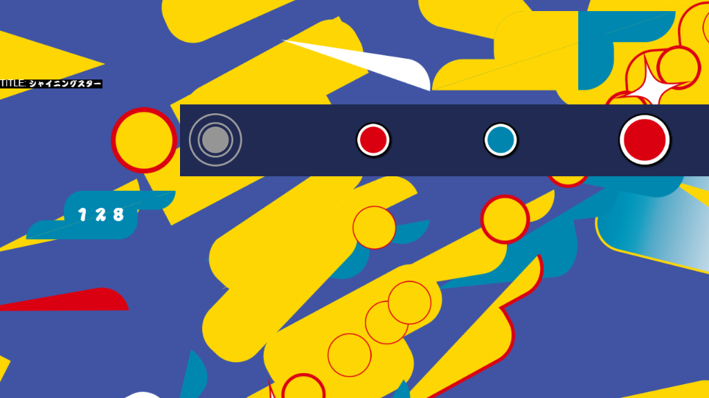

# TaikoFUN 画面デザイン確認

`hud-motion.html` をダウンロードし、EdgeまたはChromeで開いてください。
リポジトリを取得済みなら、このフォルダーの同ファイルを直接開けます。
画像は埋め込まれているため、単独で表示できます。

- 開くと再生し、3秒後から背景が動きます。
- 「一時停止」「再生」で停止・再開できます。
- 経過時間を130秒にすると、加速が終わった状態を確認できます。
- コンボ数と魂ゲージ量は画面下のスライダーで変更できます。

太鼓・コンボ枠・魂ゲージは、既存の背景の円と横長素材を組み合わせた
仮配置です。数字とゲージ量は表示例で、実ゲームの値とは連動していません。
この3部品の案はプレビューのみで、ゲームへの適用前です。

コンボ枠と数字のモーションは `Scene/Play/View/PlayEffects` に移植済みです。
太鼓と魂ゲージの仮配置は、引き続きプレビューのみです。

ゲーム用変更には、通常時の背景モーション、ノーツとレーンの配色、
白い曲名と連打数の画像表示が含まれます。`Unit-test` の新構造にも
空打ち発光・判定文字・コンボ演出を含めて移植しました。既存の
ゴーゴータイム時の`bg_clear`表示は保持しています。プレビューは
通常時の背景モーションを表示します。
